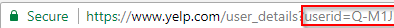

Python script to login to yelp account, scrape check-ins, export to database, and finally export to CSV.
Items scraped are restaurant name, city, and number of check-ins.

You will need to update credentials.py to hold variables specficic to your account login.  You can get the userid by first logging into your yelp account and going to your profile.  It will be in the URL.  

